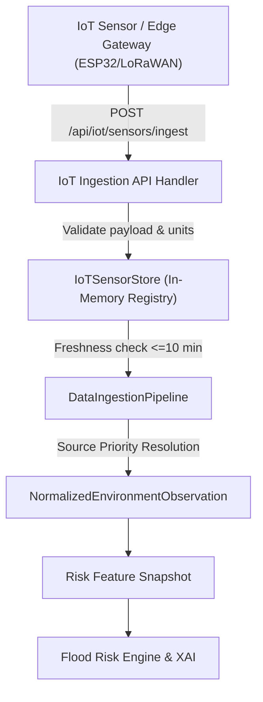

# Feature 3 — Real IoT Sensor API Ingestion Verification Report

> **Physical IoT Hardware Disclaimer**: Physical IoT hardware is not connected in the current demonstration environment. This feature implements the real ingestion API and source-selection architecture required for sensor integration (ESP32 / LoRaWAN gateway integration).

---

## 1. Architecture Overview

Feature 3 adds a production-style REST API ingestion layer for real-time IoT environmental sensors (rainfall, soil moisture, and water level). Sensor observations are validated, maintained in an in-memory registry, evaluated for freshness, and integrated into the APADA MITRA data ingestion pipeline using explicit source priority without blending.



---

## 2. API Endpoints

| Method | Endpoint | Description |
| :--- | :--- | :--- |
| `POST` | `/api/iot/sensors/ingest` | Ingests new IoT sensor observation payload |
| `GET` | `/api/iot/sensors` | Returns all registered latest IoT sensor observations with freshness |
| `GET` | `/api/iot/sensors/{sensor_id}` | Returns latest observation for specific sensor ID |
| `GET` | `/api/iot/villages/{village_id}/sensors` | Returns all latest IoT observations for a given village |

---

## 3. Sample Ingestion Payload & Response

### Request Payload (`POST /api/iot/sensors/ingest`)

```json
{
  "sensor_id": "RAIN-001",
  "sensor_type": "rainfall",
  "village_id": "VIL-003",
  "value": 12.5,
  "unit": "mm/h",
  "timestamp": "2026-09-04T16:30:00Z"
}
```

### Successful Response (`HTTP 200 OK`)

```json
{
  "sensor_id": "RAIN-001",
  "sensor_type": "rainfall",
  "village_id": "VIL-003",
  "value": 12.5,
  "unit": "mm/h",
  "timestamp": "2026-09-04T16:30:00Z",
  "received_at": "2026-09-04T16:54:30.123456+00:00",
  "source": "IOT_SENSOR",
  "status": "LIVE",
  "freshness_seconds": 12.4,
  "validation_status": "VALID"
}
```

---

## 4. Ingestion Validation Rules

* **Village Registration**: Rejected with `HTTP 404` if `village_id` is unknown (must match monitored watershed villages `VIL-001` to `VIL-015`).
* **Sensor Type Check**: Rejected with `HTTP 400` if `sensor_type` is not `rainfall`, `soil_moisture`, or `water_level`.
* **Unit Validation**:
  * `rainfall`: allowed units `mm/h`, `mm`
  * `soil_moisture`: allowed units `m3/m3`, `%`
  * `water_level`: allowed units `m`
* **Non-negative Constraint**: Rejected with `HTTP 400` if `value < 0` or if `value` is non-numeric/NaN/Infinity.
* **Timestamp Parsing**: Rejected with `HTTP 400` if `timestamp` fails ISO 8601 parsing.

---

## 5. Freshness Classification & Source Priority

### Freshness Thresholds
* **`LIVE`** (`LIVE_IOT_SENSOR`): Observation age $\le 10\text{ minutes}$ ($600\text{ seconds}$).
* **`STALE`**: Observation age $> 10\text{ minutes}$ and $\le 30\text{ minutes}$ ($1800\text{ seconds}$).
* **`OFFLINE`**: Observation age $> 30\text{ minutes}$.

### Explicit Source Priority (No Max/Min Blending)
1. **`LIVE_IOT_SENSOR`**: Used if a valid, fresh (`LIVE`) IoT sensor exists for that location and feature.
2. **`LIVE_EXTERNAL_API`**: Used if Open-Meteo live API observation is available and no fresh IoT sensor is present.
3. **`OFFLINE_DEMO`**: Used as fallback if neither fresh IoT nor external API data is available.

---

## 6. Soil Moisture Volumetric Conversion

If IoT sensor reports volumetric water content in $\text{m}^3/\text{m}^3$:
$$\text{soil\_saturation\_pct} = \operatorname{clamp}\left(0, 100, \left(\frac{\text{value}}{0.50}\right) \times 100\right)$$

*Example*: Ingestion of $0.42\text{ m}^3/\text{m}^3$ converts explicitly to **`84.0%`** saturation.

---

## 7. Automated Test Results

* **Test Suite File**: `backend/tests/test_feature_03_iot_ingestion.py`
* **Test Suite Result**: **14 passed in 3.04s**
* **Full Backend Pytest Result**: **78 passed in 15.15s**

---

## 8. Limitations & Production Recommendations

1. **In-Memory Volatility**: Sensors are stored in memory (`IoTSensorStore`). In production, replace with persistent Redis / PostgreSQL PostGIS store.
2. **Authentication & Security**: The ingest endpoint is unauthenticated for hackathon dev/demo. In production, add HMAC-SHA256 request signatures or OAuth2 device bearer tokens for ESP32/LoRaWAN gateways.
