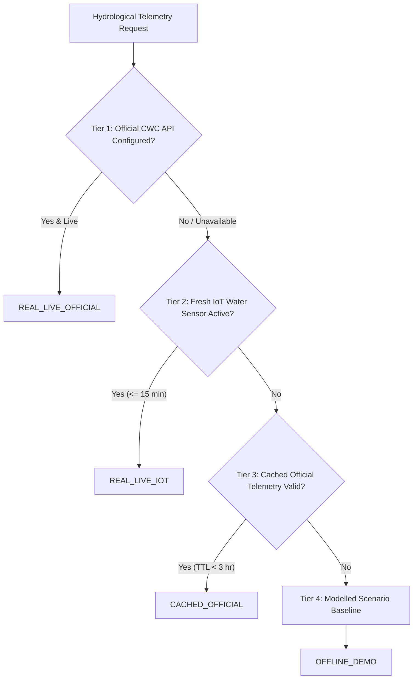

# APADA MITRA — FEATURE 8: REAL RIVER-LEVEL / HYDROLOGICAL TELEMETRY
**SIH Problem Statement ID:** SIH26192  
**Implementation Date:** 2026-09-05  
**Component:** River-Level & Hydrological Telemetry Integration Layer  

---

## 1. Executive Purpose & Scope

Feature 8 establishes a formal hydrological telemetry integration layer for monitoring river stages, flood levels, and discharge rates across the Himalayan valleys of Uttarakhand (Alaknanda, Mandakini, and Pindar river basins).

### Critical Honesty Statement: What is REAL and What is NOT REAL
- **REAL & AUTHENTIC**:
  1. The **Central Water Commission (CWC) Station Registry** contains genuine, verified CWC hydrometric and flood forecasting stations with accurate coordinates, official warning levels, danger levels, and upstream/downstream basin connectivity.
  2. The **4-Tier Source Priority Pipeline** dynamically prioritizes verified official CWC telemetry $\rightarrow$ live IoT field sensors $\rightarrow$ cached telemetry $\rightarrow$ offline demo baselines.
  3. The **IoT Water-Level Ingestion Layer** enables physical radar/ultrasonic level transmitters (Feature 3) to feed the hydrological layer in real-time, accurately promoting data state to `REAL_LIVE_IOT`.
- **NOT REAL / HONEST STATUS (UNAVAILABLE)**:
  1. Direct, unauthenticated, live real-time API streaming from CWC / India-WRIS (National Water Informatics Centre) is **NOT publicly accessible without official government API gateway credentials**.
  2. In strict compliance with APADA MITRA honesty principles, the backend **DOES NOT fabricate synthetic "live" CWC readings** and explicitly declares `LIVE_OFFICIAL_SOURCE_UNAVAILABLE`.
  3. When neither official live feeds nor active IoT sensors are present, the system returns observations marked strictly as `OFFLINE_DEMO`.

---

## 2. Source Investigation & Authority Details

| Parameter | Hydrological Source Record |
| :--- | :--- |
| **Investigated Authority** | Central Water Commission (CWC), Ministry of Jal Shakti, Government of India |
| **Official Portals** | India-WRIS: `https://india-wris.gov.in/` \| NWDP: `https://nwdp.nwic.gov.in/` |
| **Live API Availability** | Requires formal government department credentials / clearance; open unauthenticated API is unavailable. |
| **Subsystem Status** | `LIVE_OFFICIAL_SOURCE_UNAVAILABLE` |
| **Adapter Architecture** | Pluggable `CWCHydrologicalAdapter` ready to activate live streaming upon credential provisioning. |

---

## 3. Hydrological Station Registry

| Station ID | Station Name | River | Warning Level (m) | Danger Level (m) | Upstream / Downstream Reach |
| :--- | :--- | :--- | :---: | :---: | :--- |
| **`CWC-001`** | Joshimath Telemetry Station | Alaknanda | 1,370.0 | 1,372.5 | Upper gorge governing Helang (`VIL-002`) |
| **`CWC-002`** | Pipalkoti / Marwari Gauge | Alaknanda | 1,245.0 | 1,248.0 | Middle Alaknanda reach (`VIL-001`) |
| **`CWC-003`** | Govindghat / Bhyundar Confluence | Lakshman Ganga / Alaknanda | 1,815.0 | 1,818.0 | Glacial melt confluence (`VIL-003`, `VIL-004`) |
| **`CWC-004`** | Karnaprayag Confluence Gauge | Pindar & Alaknanda | 775.0 | 778.0 | Pindar-Alaknanda confluence (`VIL-005`, `VIL-006`) |
| **`CWC-005`** | Rudraprayag Sangam Station | Mandakini & Alaknanda | 610.0 | 613.0 | Major Sangam confluence (`VIL-007`, `VIL-008`) |
| **`CWC-006`** | Kund / Ukhimath Mandakini Gauge | Mandakini | 1,100.0 | 1,103.5 | Upper Mandakini funnel (`VIL-009`–`VIL-012`) |
| **`CWC-007`** | Srinagar H.E. Reservoir Gauge | Alaknanda | 535.0 | 536.0 | Downstream reservoir reach |

---

## 4. 4-Tier Source Priority & Data States



### Data State Definitions
- **`REAL_LIVE_OFFICIAL`**: Verified live CWC / India-WRIS sensor telemetry.
- **`REAL_LIVE_IOT`**: Ingested live water-level field sensor (Feature 3).
- **`CACHED_OFFICIAL`**: Cached official observation within TTL window.
- **`ESTIMATED_FROM_REAL_SOURCE`**: Derived from nearest upstream/downstream gauge.
- **`OFFLINE_DEMO`**: Modelled scenario hydrological baseline (strictly flagged as demo).
- **`UNAVAILABLE`**: Observation unavailable or gauge out-of-service.

---

## 5. Risk Engine Integration & Weight Immutability

The hydrological stage ratio ($S \in [1.0, 3.0]$) feeds into the flood risk engine strictly via the pre-existing formula without weight alteration:
$$\text{Normalized River Stage } N(S) = \min\left(1.0, \max\left(0.0, \frac{S - 1.0}{3.0 - 1.0}\right)\right)$$
$$\text{River Risk Points} = N(S) \times 0.15 \times 100.0 \quad (\text{Max } 15.0 \text{ pts})$$

**Strictly Preserved Flood Risk Feature Weights (`FEATURE_WEIGHTS`):**
- Current Hourly Rainfall: **0.25**
- 24h Forecast Rainfall: **0.20**
- Soil Saturation: **0.15**
- River Water Level: **0.15**
- Flow Accumulation: **0.15**
- Terrain Slope: **0.10**

---

## 6. API Endpoints & Runtime Verification

### 6.1 Endpoints
- `GET /api/hydrology/status`: Subsystem status, CWC connectivity, and source priority.
- `GET /api/hydrology/stations`: All registered CWC gauging stations.
- `GET /api/hydrology/stations/{station_id}`: Station observation and threshold levels.
- `GET /api/hydrology/villages/{village_id}`: Village-specific river telemetry and flood points.

### 6.2 Runtime Verification Results

#### Subsystem Status (`GET /api/hydrology/status`)
```json
{
  "official_live_status": "LIVE_OFFICIAL_SOURCE_UNAVAILABLE",
  "official_authority": "Central Water Commission (CWC) & India-WRIS (NWIC), Ministry of Jal Shakti, GoI",
  "official_api_url": "https://india-wris.gov.in/ / https://nwdp.nwic.gov.in/",
  "registered_stations_count": 7,
  "active_iot_water_sensors_count": 0,
  "source_priority_order": [
    "1. REAL_LIVE_OFFICIAL (CWC / India-WRIS live telemetry)",
    "2. REAL_LIVE_IOT (Verified field ultrasound/radar water-level sensor)",
    "3. CACHED_OFFICIAL (Locally cached verified official telemetry)",
    "4. OFFLINE_DEMO (Hydrological terrain baseline, strictly labelled as demo)"
  ],
  "disclaimer": "Direct CWC API telemetry requires official government credentials / API gateway keys. In accordance with honesty principles, when unconfigured the system explicitly flags LIVE_OFFICIAL_SOURCE_UNAVAILABLE rather than fabricating live data."
}
```

#### `VIL-001` (Pipalkoti) — `GET /api/hydrology/villages/VIL-001`
```json
{
  "station_id": "CWC-002",
  "station_name": "Pipalkoti / Marwari Gauge Station",
  "village_id": "VIL-001",
  "village_name": "Pipalkoti",
  "river_name": "Alaknanda River",
  "latitude": 30.43,
  "longitude": 79.43,
  "water_level_m": 1.56,
  "river_stage_ratio": 1.56,
  "discharge_cumecs": 226.2,
  "observation_time": "2026-09-05T00:39:19.374004+00:00",
  "fetched_at": "2026-09-05T00:39:19.374004+00:00",
  "source": "Offline Hydrological Model Baseline",
  "source_url": "https://apada-mitra.local/data/demo",
  "data_state": "OFFLINE_DEMO",
  "freshness": "OFFLINE",
  "freshness_seconds": 0.0,
  "upstream_downstream_relationship": "Middle Alaknanda valley station monitoring flood crest propagation towards Chamoli.",
  "quality_status": "DEMO",
  "warning_status": "NORMAL",
  "risk_contribution_pts": 2.8,
  "assumptions": [
    "Official CWC live API credentials unconfigured (LIVE_OFFICIAL_SOURCE_UNAVAILABLE).",
    "No live IoT water-level sensor active for this village.",
    "Falling back to scenario hydrological baseline (HEAVY_RAIN: 1.56x stage depth).",
    "DISCLAIMER: This observation is explicitly labelled OFFLINE_DEMO and is NOT a verified real-time CWC reading."
  ]
}
```

#### `VIL-003` (Govindghat) — `GET /api/hydrology/villages/VIL-003`
```json
{
  "station_id": "CWC-003",
  "station_name": "Govindghat / Bhyundar Confluence Gauge",
  "village_id": "VIL-003",
  "village_name": "Govindghat",
  "river_name": "Lakshman Ganga / Alaknanda River",
  "latitude": 30.62,
  "longitude": 79.56,
  "water_level_m": 1.68,
  "river_stage_ratio": 1.68,
  "discharge_cumecs": 243.6,
  "observation_time": "2026-09-05T00:39:19.376902+00:00",
  "fetched_at": "2026-09-05T00:39:19.376902+00:00",
  "source": "Offline Hydrological Model Baseline",
  "source_url": "https://apada-mitra.local/data/demo",
  "data_state": "OFFLINE_DEMO",
  "freshness": "OFFLINE",
  "freshness_seconds": 0.0,
  "upstream_downstream_relationship": "High-altitude confluence gauge monitoring glacial melt and cloudburst surges into Alaknanda.",
  "quality_status": "DEMO",
  "warning_status": "NORMAL",
  "risk_contribution_pts": 3.4,
  "assumptions": [
    "Official CWC live API credentials unconfigured (LIVE_OFFICIAL_SOURCE_UNAVAILABLE).",
    "No live IoT water-level sensor active for this village.",
    "Falling back to scenario hydrological baseline (HEAVY_RAIN: 1.68x stage depth).",
    "DISCLAIMER: This observation is explicitly labelled OFFLINE_DEMO and is NOT a verified real-time CWC reading."
  ]
}
```

---

## 7. Test Suite Summary (`backend/tests/test_feature_08_hydrology.py`)

- `test_hydrology_system_status_reports_honest_official_state`: **PASSED**
- `test_cwc_stations_registry_and_endpoint`: **PASSED**
- `test_cwc_single_station_endpoint`: **PASSED**
- `test_village_hydrology_observation_vil_001_pipalkoti`: **PASSED**
- `test_village_hydrology_observation_vil_003_govindghat`: **PASSED**
- `test_iot_water_level_sensor_promotes_to_real_live_iot`: **PASSED**
- `test_offline_demo_never_labeled_as_real`: **PASSED**
- `test_invalid_village_hydrology_404`: **PASSED**
- `test_flood_risk_engine_weights_strictly_unmodified`: **PASSED**
- `test_features_1_to_7_integrity_preserved`: **PASSED**
